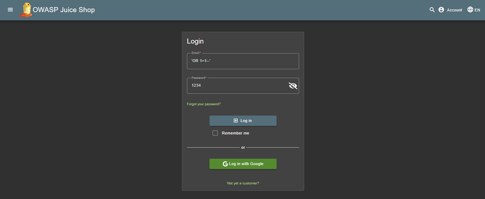
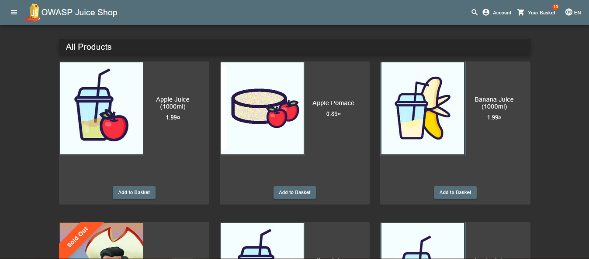
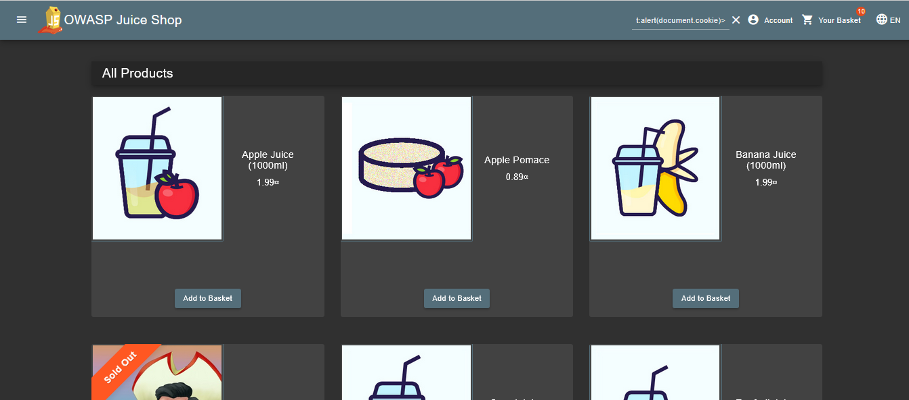
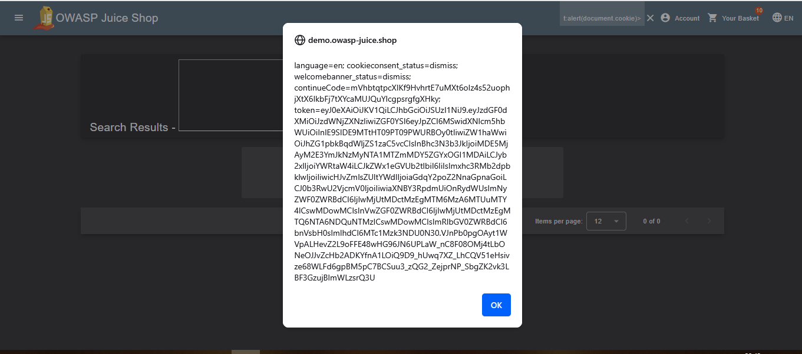
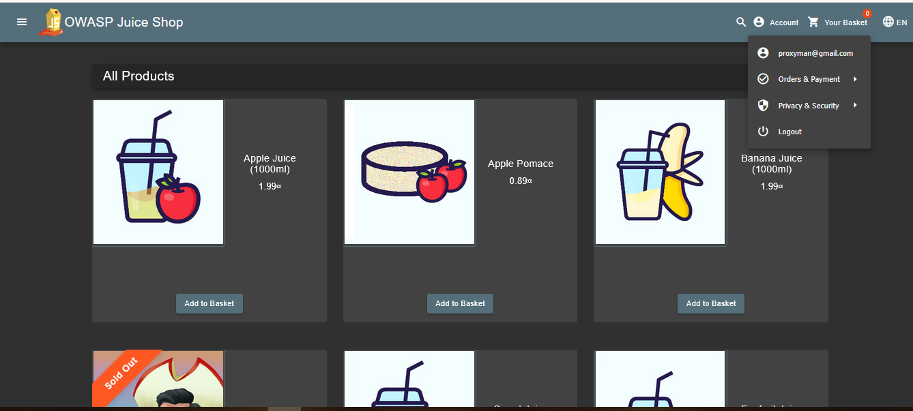
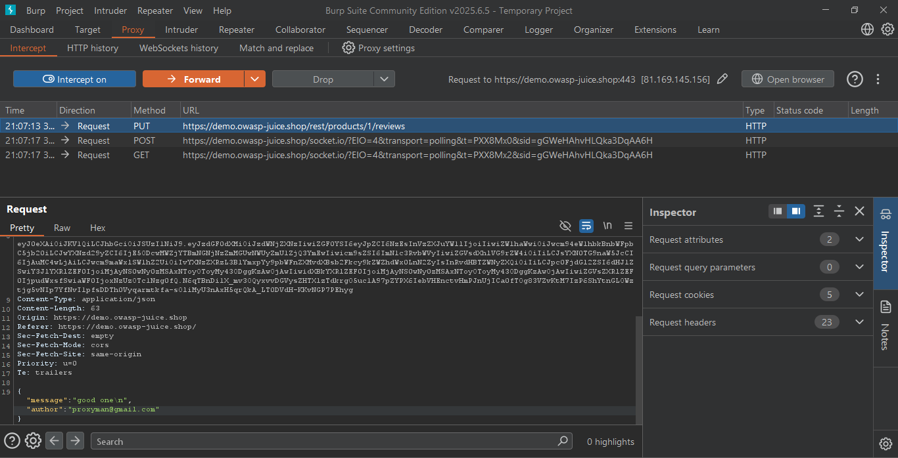
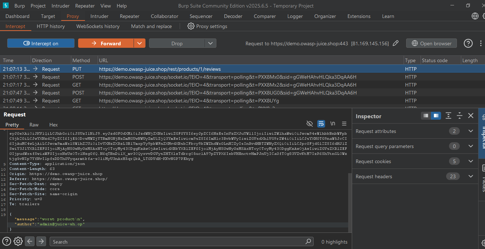
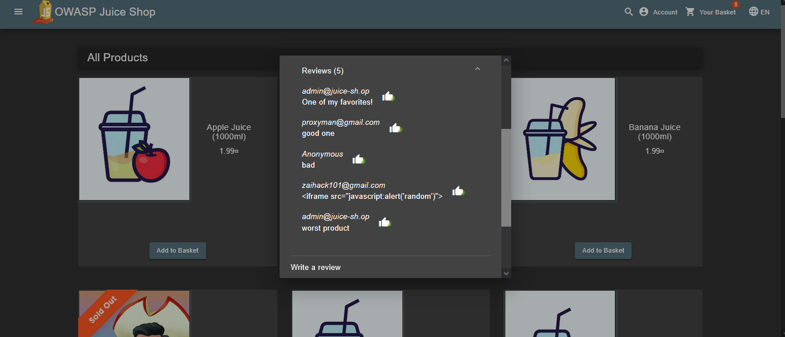
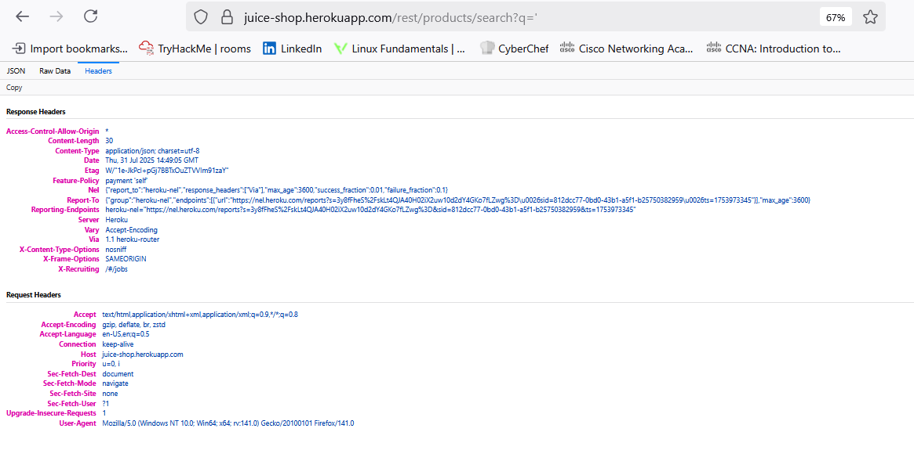
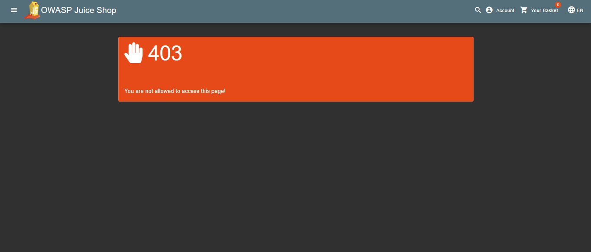

# 🔐 Cyber Security Internship – Future Interns

This repository contains **Task 1** for my Cyber Security Internship with **Future Interns**.

---

## 👤 Intern Details

- **Intern Name:** Mithileshwaran  
- **Internship Domain:** Cyber Security  
- **Task Title:** Web Application Security Testing  
- **Website Tested:** [https://demo.owasp-juice.shop](https://demo.owasp-juice.shop)  
- **Date:** August 2025

---

## 🔍 Task Objective

Perform security testing on an intentionally vulnerable web application to identify:

- SQL Injection (SQLi)
- Cross Site Scripting (XSS)
- Insecure Direct Object Reference (IDOR)
- Information Disclosure
- Broken Access Control

---

## 🛠 Tools Used

- **Burp Suite (Community Edition)**
- **Manual Testing via Web Browser**
- Target Application: **OWASP Juice Shop**

---

## ✅ Vulnerabilities Identified

### 1. SQL Injection (SQLi)

- **Payload Used:** `' OR 1=1--`
- **Result:** Login bypass successful.
- **Screenshots:**  
    
  

---

### 2. Cross Site Scripting (XSS)

- **Payload Used:** ``
- **Result:** Alert box triggered via Feedback form.
- **Screenshots:**  
    
  

---

### 3. IDOR (Insecure Direct Object Reference)

- **Test Scenario:** Changing the comment ID in API request manually.
- **Result:** Able to edit other users’ comments.
- **Screenshots:**  
    
    
    
    
  

---

### 4. Information Disclosure

- **Test Scenario:** Observing HTTP response headers.
- **Result:** Server technology and version exposed.
- **Screenshot:**  
  

---

### 5. Broken Access Control

- **Test Scenario:** Tried accessing admin-only pages as unauthorized user.
- **Result:** 403 Forbidden returned (Access Blocked).
- **Screenshot:**  
  

---

## 📄 Full Report

See the detailed report with findings and mitigation steps:  
📄 **[Security Testing Report.pdf](Security%20Testing%20Report.pdf)**

---

## 🌐 Connect with Me

- 🔗 [LinkedIn](https://linkedin.com/in/mithileshwaran)  
- 📫 mithileshwarananbu2022@gmail.com

---

> ⚠️ **Disclaimer:** This testing was conducted on a vulnerable lab environment (OWASP Juice Shop) strictly for learning and educational purposes.
